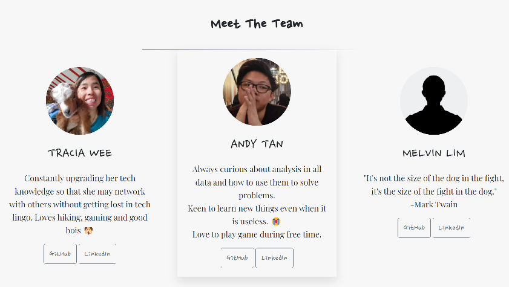

## **Final Project -**
## **Heptagon, A Furniture E-Commerce Website**

 

- Our team came out with a minimum viable product (MVP).

- Developing web application for a Furniture E-commerce website with a casual but professional layout.

---

 

## Table of contents

- [Overview](#overview)
- [Project Content](#project-content)
- [Screenshot](#screenshot)
- [Links](#links)
- [Built Using](#built-using)
- [Contributors](#contributors)
- [Special Thanks](#special-thanks)

 

## **Overview**

---

 

### **Project Introduction**

- Based on MVP design structure, our page includes of the Home page, Product page, About Us Page & Add Product Page. 

- That user will be able to view the different pages in responsive layout depending on their device's screen size.

### **Home Page** 

- Static home page, we spill the design layout into 3 parts - Navbar, Main & Footer

- Navbar design having a home icon, shop, about us, contact us & form tag. 
(We have a Navbar Brand, the home icon is for users easily identifiable the home page as we understand the navbar brand might not be obvious to some users) 

- Our Navbar Brand locate at the center with an eyeball that follows the user movement of the pointer.

- Main body displays a carousel that will switch to a different image banner & below is a feature product with a hover effect on the product image.

- Footer 

#### **Page Challenge**

- Creating the Navbar design, Eyeball feature & Responsive design.

 

### **Products Page** 

- This page will show all the products that will be generated by API to display information from the database on the page dynamic. (As we will show during the later part when product is added & it will show up dynamic depending on our database)

- We have hidden our product name, price & view more detail button unless the user hovers the product to make the page look cleaner.

- Our search bar will filter when the user keys anything in the input.

#### **Page Challenge**

- Create dynamic hidden hover effect for the product & search bar that can retrieve data from the API

 

### **Products Description Page** 

- After clicking on the view more detail button, it will bring the user to a new page dynamic depending on the product you have clicked, it will display the product information like name, description, dimension & price with an add that cart button that still not working yet.

- The dynamic data passing is done by using browser local storage to store the data we have gotten at the product page to pass it over to the product description page.

#### **Page Challenge**

- To pass the data from the product page & dynamic display the product user clicked.

 

### **Add Product Form** 

- After admin login, they will be able to add a new product. There is some validation done before the product is added to the backend.

- After the product is added, it will be dynamic shown on the product page.

#### **Page Challenge**

-To link the form with the backend database in order to POST through the API.

 

### **Contact Us Page**

- Static Contact Us page with a feedback form for customers to send messages to the company,
  which does not work yet. The fixed background image makes the page look interesting.
- Next, the page includes the company's address, operational hours, contact details and
  clickable links to social media.

#### **Page Challenge**

N/A

 

### **About Us Page**

- Static About Us page that starts with a short intro about this project. The client may
  input their company mission, story and social responsibility statements here.

- Next, we have a team overview intro about our team.

- Below we have our team profiles that also have the same hover effect as the home page feature product.
- In our team profile is a short bio, photo with our GitHut & LinkedIn button.

#### **Page Challenge**

- Making the text readable with background image

 

---
## **Reflections**

Additional features that can be considered in the future:

- Add to Cart
- Admin Dashboard
- Promotion banners
- Working Contact Us form that POST to database

Limitations:
- Website is deployed using Heroku server (free version) that deletes posted products after 24 
  hours. 
- Collective inexperience of the team means we have yet to be exposed to more frameworks or 
  programming languages that may make the site more effective.  

---

 

## **Screenshot**

Home Page

Shop Page

Login Page

Form Page

About Us Page

Contact Us Page

 

---

 

## **Links**

- Solution URL: [https://github.com/AndyT-PrimoSpade/HeptagonE](https://github.com/AndyT-PrimoSpade/HeptagonE)
- Live Site URL: [https://heptagone.herokuapp.com](https://heptagone.herokuapp.com)
<!-- 
 -->

 

---

 

## **Built Using**

- HTML 5 - (Structure Content)
- CSS & Bootstrap - (Page Style & Layout)
- Java - (Backend API)
- Spring Boot - (Java Framework)
- mySQL - (Database)
- Heroku - (Cloud Deployment)

 

---

 

## **Contributors**

- **~Team Member~**
- Tracia Wee
- Andy Tan
- Melvin Lim

 

---

 

## **Special Thanks**

- Jean Looi, our Lecturer during this Bootcamp.
- Wonderful team from Generation Singapore.
- Our Mentors, Netra Prabhu and Kirk Zhang

 

---